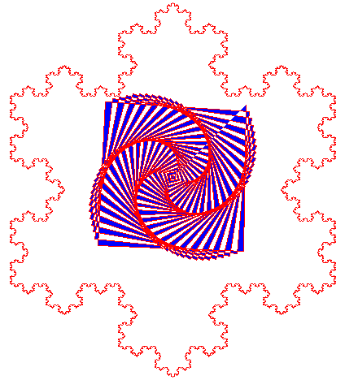

## Fractal Turtle

This is a simple fractal program written in Python.

### Prerequisites

* Python 3.6 or higher
* Poetry

### Installation

```
poetry install && poetry shell
```

### Usage

```
python fractal_turtle.py
```

### Example


